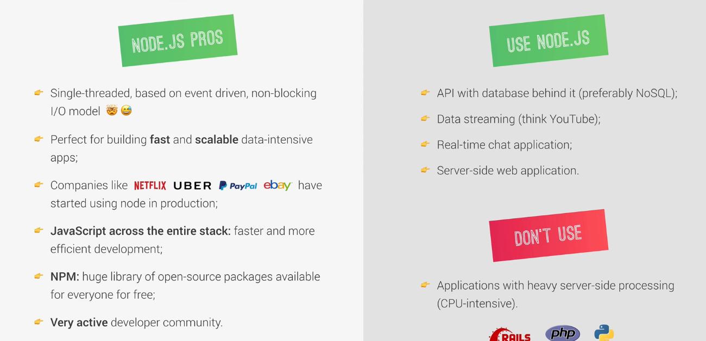

## What is NodeJS
Node Js in a javascript runtime built on Google's open source V8 Javascript Engine

Perfect conditions for using Node Js as a web server
We can use Javascript on server side for development
Building fast , highly scalabe network applications.

## Why and When to Use
