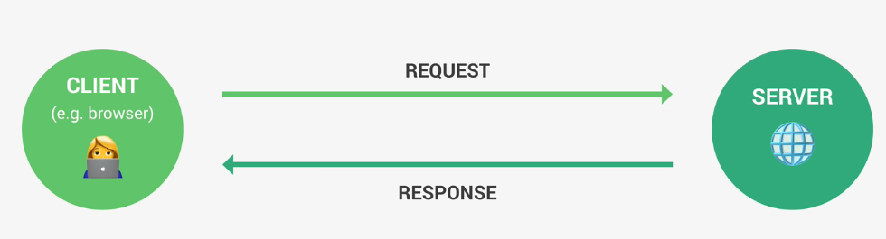
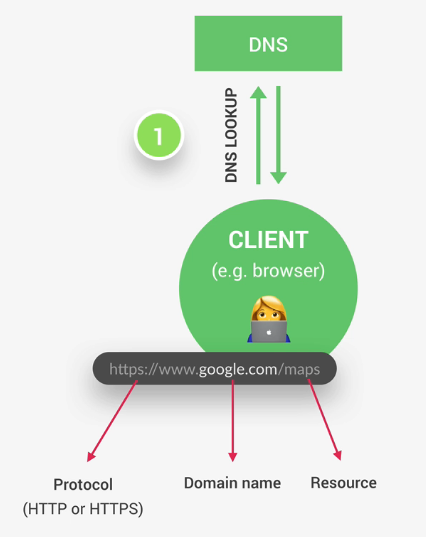
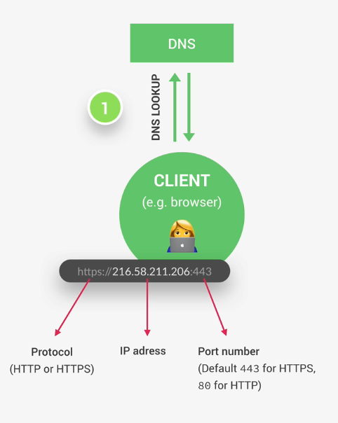
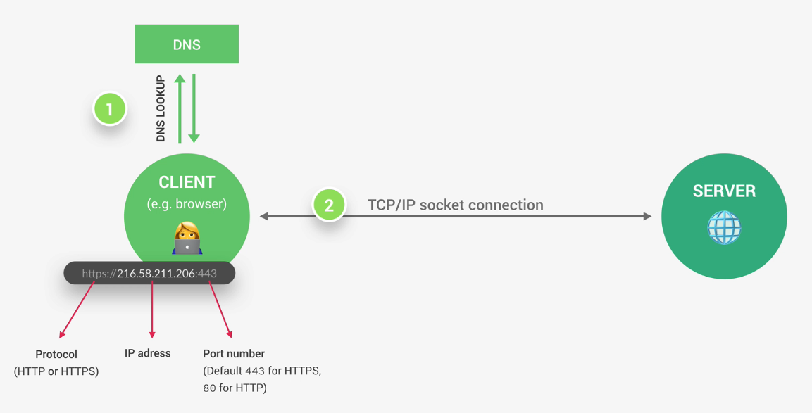
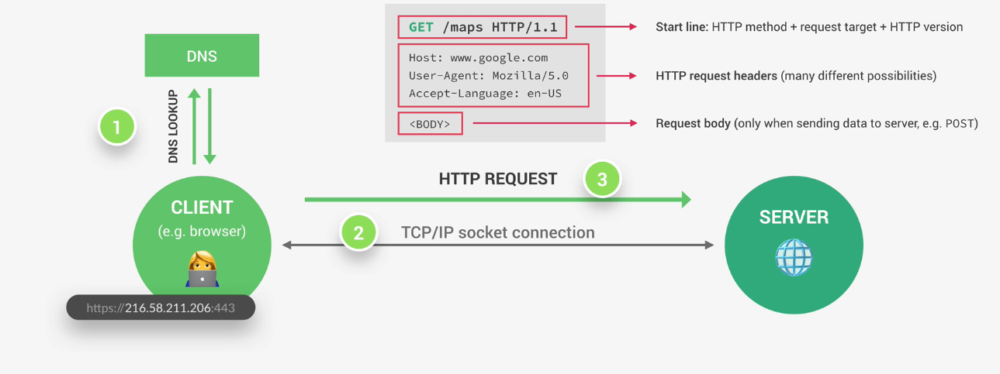
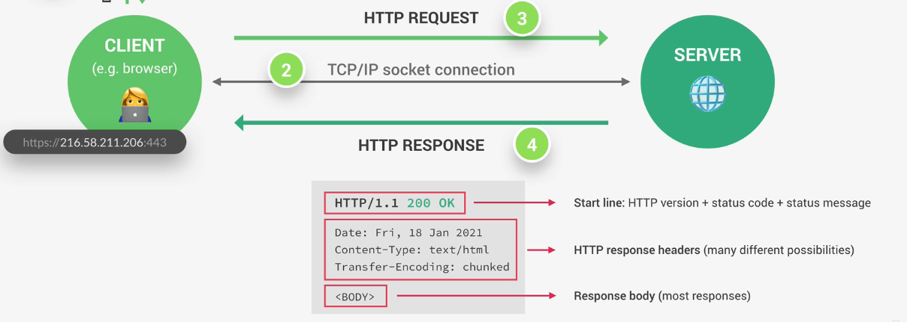
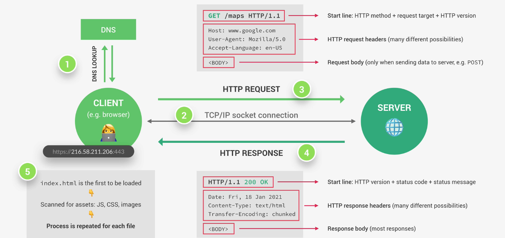

## What happens we access a webpage
### Request response Model

### DNS LookUp
Domain is not the real address
Happens through IP 

 

### TCP Socket Connection is established between Server a browser 
Defines how data travels across the web
 

### HTTP Requst
 

encrytped with TLS and SSL protocol 

### HTTP Response

### Request
New Request will be made everytime new resource is required

TCP/IP job is to break request into small chunks packets and then reassemble
