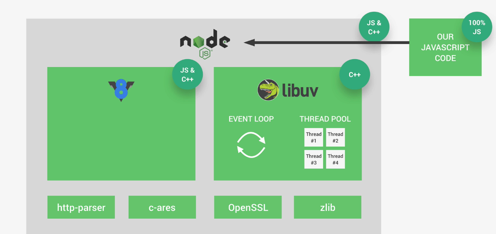
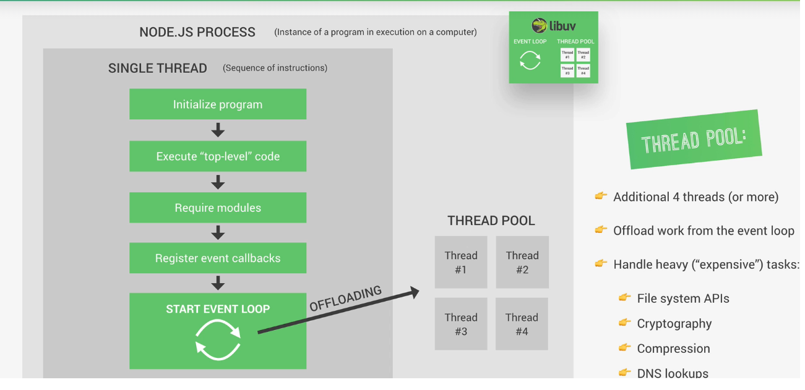

# Node V8 Libuv and C++

## Node Architecture 

V8 is the fundamental part in Node Arch
Without it, wont be able to understand javascript code

### Libuv
Open Source Library with strong focus on Asynchronous I/O
OS,network system,File System

Event Loop
  Responsible for handling simpler task 
  Executing callbacks
  Network IO
Thread Pool
  File Access
  Compression

V8  in  Js and C++  and Libuv are written in c++

It also has 
| Packages    	| Functionality        	|
|-------------	|----------------------	|
| http-parser 	| parsing HTTP request 	|
| c-ares      	| For DNS Request      	|
| OpenSSL     	| Cryptography         	|
| zlib        	| Compression          	|

## Process and Thread

